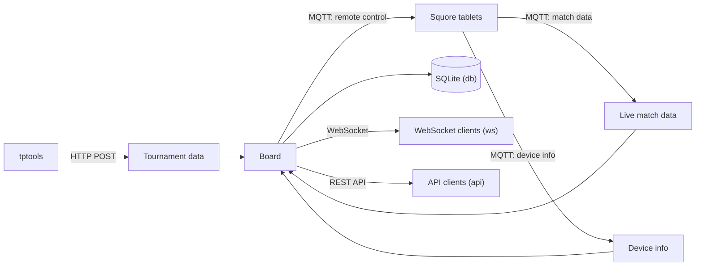

[](https://github.com/madduck/tcboard/actions/workflows/0-testing.yml)

# TCBoard — Server to collect and provide tournament data

`tcboard` collects tournament data and live match data, keeps track of what is happening on each court, and distributes this to whoever needs it, such as the court displays and the referees' tablets. It is the server side of the squash tournament setup built around [tptools](https://github.com/madduck/tptools) and [Squore](https://squore.double-yellow.be/).

* [Background](#background)
* [Installation](#installation)
* [Usage](#usage)
  * [Plugins](#plugins)
  * [Endpoints](#endpoints)
* [Contributing](#contributing)
* [Legalese](#legalese)

## Background

`tcboard` receives data from three sources:

1. **Tournament data** from [tptools](https://github.com/madduck/tptools), which reads them from TournamentSoftware. These are posted over HTTP.
2. **Live match data** from Squore, the scoring app running on the tablets at each court. These arrive via MQTT.
3. **Device information** from Squore, such as the battery level of each tablet. This also arrives via MQTT.

These inputs are combined into a single in-memory board. The board knows about the tournament, the state of each match, the alerts raised on each court, and which device is on which court. Every change to the board is then passed on to whatever is subscribed:



A few things happen along the way:

* When a new tournament arrives, the matches in it are merged with the matches the board already knows about, and each match keeps its live state.
* When live data for a match arrives, it is checked and stored against that match. If the tournament hasn't arrived yet, the live data is held until it does.
* When a match with a known device is put on a court, `tcboard` can send the tablet on that court a remote-control message, so the match appears on the tablet without anyone having to select it.
* Problems, such as live data for an unknown match, are recorded as alerts against the court they relate to. Someone can then acknowledge or clear them through the API.
* A match is "acknowledged" once the result in the tournament matches the live result from the tablet. A referee or the tournament desk can also acknowledge, unacknowledge, or reset a match through the API.

Everything that changes is also written to a SQLite database if the `db` plugin is enabled. The `replay` plugin reads this database back and feeds the events through the board again, optionally sped up. This makes it possible to reproduce what happened at a tournament, and to test changes without a live setup.

## Installation

`tcboard` requires Python 3.13 or higher. To install the latest release, run:

```
pip install tcboard
```

or, to install the current state of development:

```
pip install https://github.com/madduck/tcboard/archive/refs/heads/main.zip
```

To verify that it works, run:

```
> tcboard --help
Usage: tcboard [OPTIONS] COMMAND1 [ARGS]... [COMMAND2 [ARGS]...]...
[…]
```

## Usage

```
Usage: tcboard [OPTIONS] COMMAND1 [ARGS]... [COMMAND2 [ARGS]...]...

  Collect tournament data and distribute to subscribers

Options:
  --config LOCATION             Location of the configuration file. Supports
                                local path with glob patterns or remote URL.
                                [default: ~/.config/tcboard/cfg.toml]
  -v, --verbose                 Increase the default WARNING verbosity by one
                                level for each additional repetition of the
                                option.
  --very-debug                  Do not silence any debug logging
  -h, --host IP                 Host to listen on (bind to)  [default:
                                0.0.0.0]
  -p, --port PORT               Port to listen on  [default: 8001;
                                1024<=x<=65535]
  -d, --debug-match-id MATCHID  Match ID to debug
  --help                        Show this message and exit.

Commands:
  api         Mount API endpoints for data manipulation
  db          Listen to live Squore match data on MQTT
  debug       Allow for debug-level interaction with the CLI
  remotectrl  Remote-control clients when matches are put on court
  replay      Replay events from database
  squoremqtt  Listen to live Squore match data on MQTT
  tptools     Mount endpoints to receive data from tptools
  ws          Mount endpoints to serve board data on WebSockets
```

### Plugins

The work is done by plugins, which are listed as commands. Several can be chained on one command line, and each one adds a part to the running server:

```
tcboard -p 8001 tptools squoremqtt db ws api remotectrl
```

The options of each plugin are shown by its `--help`, for instance `tcboard ws --help`. Default settings can be placed in the configuration file, and options given on the command line override them.

| Plugin       | Purpose                                                                 |
|--------------|-------------------------------------------------------------------------|
| `tptools`    | Receive tournament data and Squore results posted by tptools            |
| `squoremqtt` | Receive live match data and device information from Squore over MQTT    |
| `db`         | Persist incoming tournament, live and board data to SQLite              |
| `replay`     | Feed events recorded in a SQLite database back through the board        |
| `ws`         | Serve the board to WebSocket clients                                    |
| `api`        | Serve endpoints to acknowledge, reset and clear matches and alerts      |
| `remotectrl` | Send remote-control messages to Squore tablets when matches go on court |
| `debug`      | Interactive debugging keys on the terminal                              |

`remotectrl` depends on `squoremqtt`, which must be given on the same command line, as it provides the MQTT connection `remotectrl` uses.

### Endpoints

The HTTP endpoints are served on the port given with `-p`. Both the API and WebSocket endpoints carry a version in their path, so that the protocol can change later without breaking existing clients.

The `api` plugin serves its endpoints under `/api/v1`:

* `GET /courts` lists the courts of the tournament;
* `PATCH /match/ack/{matchid}`, `PATCH /match/unack/{matchid}` and `PATCH /match/reset/{matchid}` acknowledge, unacknowledge, or reset a match;
* `PATCH /alert/clear/{courtid}/{alertid}` clears an alert on a court.

The `ws` plugin serves board data at `/ws/v1/`. When a client connects, it first receives a welcome message with the JSON schema of the board and the base URL of the API. After that it receives the board whenever it changes. A client can subscribe to particular courts with the `court` query parameter, and can limit how often it is updated with `timeout` and `at_most_every`. The schema alone is available at `/ws/v1/schema`.

The `tptools` plugin serves `POST /tptools/v1/tournament` for tournament data, and `POST /tptools/v1/squore/result` for match results posted from a tablet.

The application also answers `/` with a short status line, `/favicon.ico`, and `/robots.txt`, which asks all crawlers to stay away. The `/debug/board` and `/debug/match/{matchid}` endpoints return the current state as JSON.

## Contributing

To contribute, please ensure you have the appropriate dependencies installed:

```
pip install -e .[dev]
```

and then install the Git pre-commit hooks that ensure that any commits conform with the coding-style used by this project.

```
pre-commit install
```

ALl code is test-covered, and all contributions are expected to keep this up. Use `pytest` to run the test suite.

Note that all code is typed, and typing is part of test-coverage.

## Legalese

`tcboard` is © 2024–6 martin f. krafft <tcboard@pobox.madduck.net>.

It is released under the terms of the MIT Licence.
